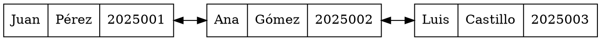

# Resumen de Graphviz

Graphviz es una herramienta de software para la visualización de grafos. Permite generar gráficos de nodos y conexiones (aristas) de manera automática a partir de un archivo de texto con formato **DOT**. Es muy usado para representar estructuras de datos, diagramas de flujo, redes y relaciones jerárquicas.

---

## Conceptos y uso de Graphviz

- **digraph**: define un grafo dirigido. Los nodos tendrán flechas que indican dirección.
- **graph**: define un grafo no dirigido.
- **node**: define atributos comunes para todos los nodos, como forma (`shape`), color, etc.
- **edge**: define atributos para las aristas, como color, dirección de flecha.
- **rankdir**: define la orientación del grafo:
  - `LR` → izquierda a derecha
  - `TB` → arriba a abajo (default)
- **shape**: define la forma del nodo. Ejemplos:
  - `box` → caja
  - `ellipse` → óvalo
  - `record` → permite dividir el nodo en campos
- **dir**: dirección de las flechas:
  - `forward` → normal
  - `back` → invertida
  - `both` → flechas en ambos sentidos
- **label**: etiqueta que se muestra dentro del nodo o sobre la arista.

---

## Ejemplo de Graphviz (DOT)


Para generar un grafo usamos el siguiente comando:
dot -Tpng {nombre del dot}.dot -o {nombre de salida de la imagen}.png


# Graphviz y tablas en nodos

Graphviz permite crear nodos con **formas de registro** o incluso **tablas HTML** para mostrar información estructurada dentro de un nodo.

---

## Crear tablas en Graphviz

- Se usa `label=<<TABLE> ... </TABLE>>` dentro de un nodo.
- Permite dividir la información en **filas (`<TR>`)** y **celdas (`<TD>`)**.
- Se puede aplicar **color**, **alineación**, **bordes** y más.

### Ejemplo simple

```dot
digraph G {
    rankdir=LR;
    node [shape=plaintext]; // Para que el nodo se vea como tabla

    alumno1 [label=<
        <TABLE BORDER="1" CELLBORDER="1" CELLSPACING="0">
            <TR><TD>Nombre</TD><TD>Apellido</TD><TD>Carnet</TD></TR>
            <TR><TD>Juan</TD><TD>Pérez</TD><TD>2025001</TD></TR>
        </TABLE>
    >];

    alumno2 [label=<
        <TABLE BORDER="1" CELLBORDER="1" CELLSPACING="0">
            <TR><TD>Nombre</TD><TD>Apellido</TD><TD>Carnet</TD></TR>
            <TR><TD>Ana</TD><TD>Gómez</TD><TD>2025002</TD></TR>
        </TABLE>
    >];

    // Conexión entre nodos
    alumno1 -> alumno2 [dir=both];
}
